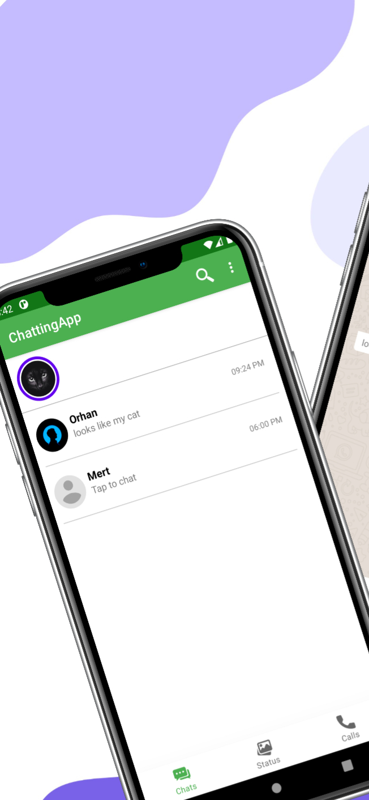
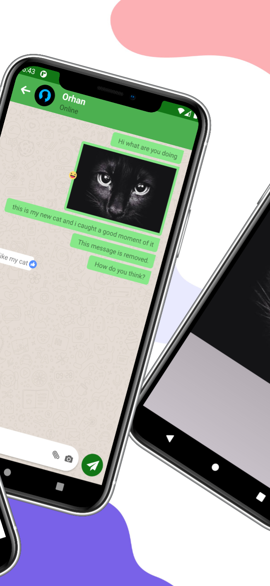
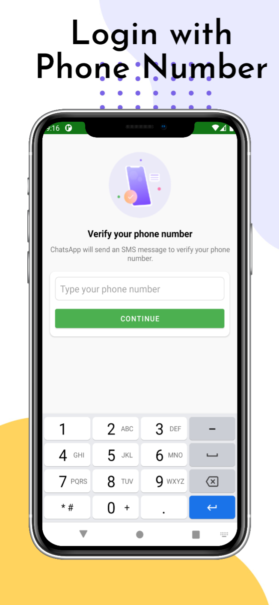
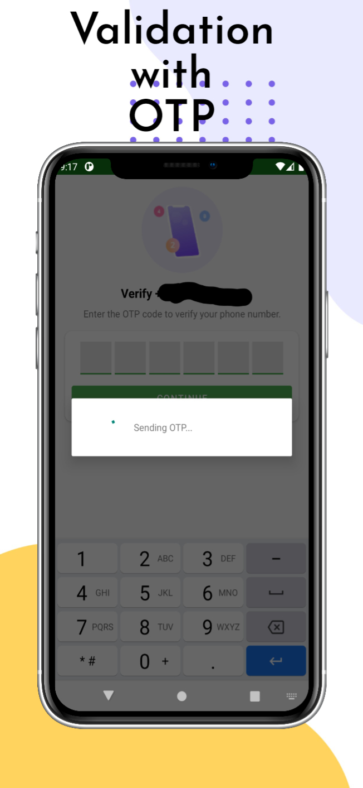
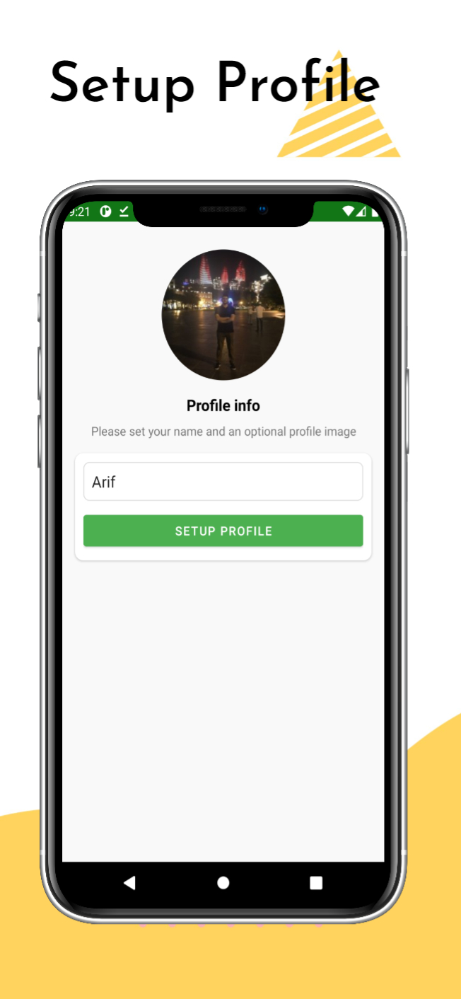

# Chatting App with Java
## Used Technologies
- Java
- Firebase Phone Authentication 
- Firebase Realtime Database
- Firebase Storage

## Functionalities in project
- Login wtih phone number
- Authentication OTP code
- Setup profile
- Chatting other people
- Sending pictures
- Reaction to messages
- Sharing status
- Online/Offline status

## UI Views

  

  

